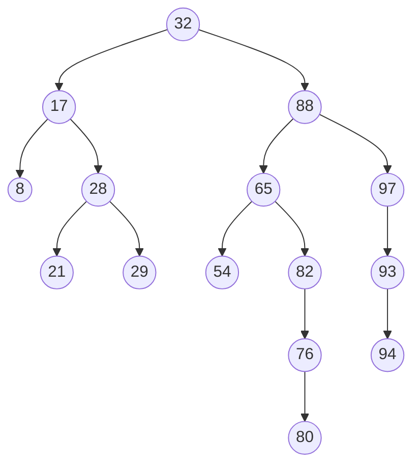
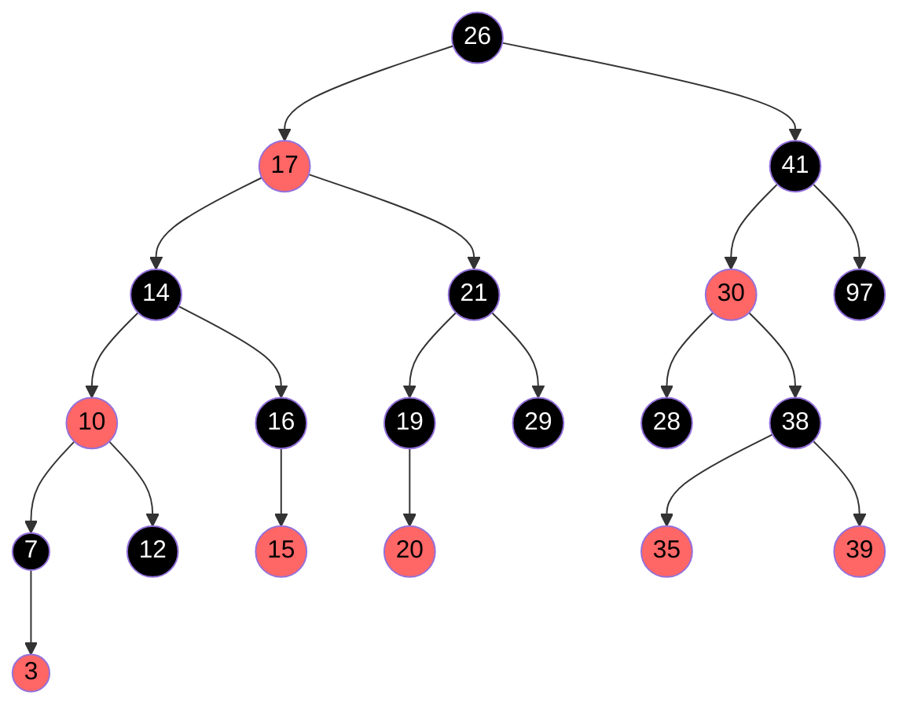
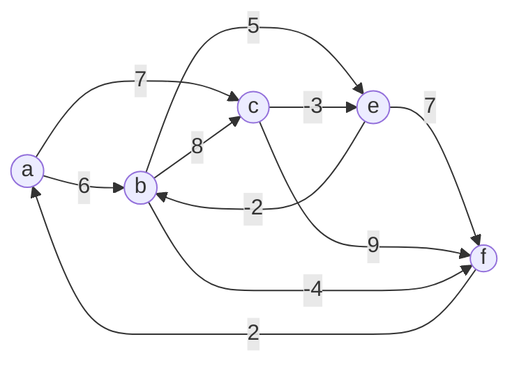
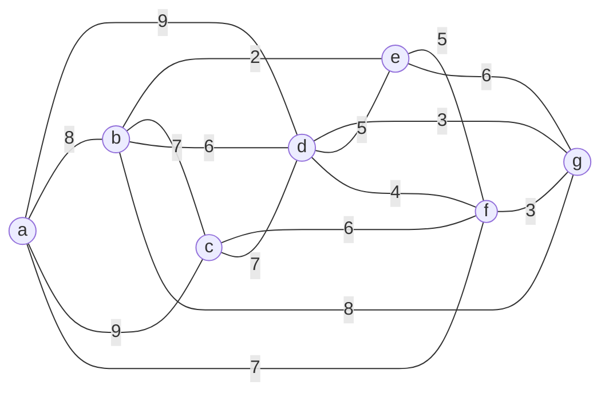

### Answer all questions. Each question carries 1 Mark.

1. Depth First Search algorithm uses ______ data structure for its implementation.
   a) Queue
   b) Stack

2. Supposing we use Dijkstra's single source shortest path algorithm on an undirected graph. What constraint must we have for the algorithm to work and why?

3. Given an arbitrary connected graph $G = (V, E)$ with edge weights in $\mathbb{R^+}$. Will the minimum cost edge in $G$ (assume there is only one such edge in $G$) always be present in every **Minimum Spanning Tree** (MST) of $G$? If your answer is YES then give a short justification, if it is NO then give a counter example.

4. A stack of `int` type is implemented using array as the following data type:

   ```c
   #define SIZE 20
   typedef struct {
       int data[SIZE];
       int top;
   } Stack;
   ```

   Fill up the missing codes in the PUSH and POP operations of the Stack.

   ```c
   void Push(Stack *s, int d) {
       ----    // statement for inserting an item d into the stack top
   }
   void Pop(Stack *s) {
       ----    // statement for removing an item from the stack top
   }
   ```

5. What is(are) the condition(s) for a graph to have a unique Minimum Spanning Tree?

---

### Answer all questions. Each question carries 2.5 Marks.

1. Let $A$ be an unsorted array of $n$ distinct integers.
   a) Describe how you can use a Binary Search Tree (BST) to sort the array $A$.
   b) Suppose the input array is already sorted in increasing order. What will be the structure of the BST?

2. Let a $\text{min} - \text{heap}$ consist of $n$ distinct elements. Where can we find the $\text{maximum}$ element? Justify your answer.

3. Let $G$ be a connected undirected graph on $n$ vertices with each edge having a cost of 1. What is the cost of a Minimum Spanning Tree of $G$? Justify your answer.

4. Write insertion and deletion operations in queue using circular linked list with header node at head.

---

## Answer all questions. Each question carries 5 Marks.

1. Consider the Binary Search Tree below. Draw the binary search tree obtained after performing the deletion of the nodes in the following order (draw the tree after each deletion). Note that while removing a node you can replace it with inorder successor only.
   


   
   a) delete 88
   b) delete 76
   c) delete 28

2. Given an array $A[1\ldots n]$ representing a min-heap below (only keys are shown in the figure) and an integer $k$. Answer the questions that follow:

   | Array index | 1 | 2 | 3 | 4 | 5 | 6 | 7 | 8 | 9 | 10 | 11 | 12 | 13 | 14 |
   |---|---|---|---|---|---|---|---|---|---|---|---|---|---|---|
   | **key** | 3 | 10 | 5 | 13 | 17 | 6 | 11 | 15 | 16 | 21 | 18 | 9 | 8 | 23 |

   a) Give the array after performing one `deleteMin()` operation. (2 Marks)
   
   b) Design an algorithm to output all the keys in the array that are less than $k$. (For example if $k = 6$ and the array $A$ is as shown below, then your algorithm should output the keys 3 and 5.) (3 Marks)

3. Draw the Red-Black tree that results after TREE-INSERT is called on the tree in figure with key 36. If the inserted node is colored red, is the resulting tree a red-black tree? What if it is colored black?



4. With the help of a pseudocode, briefly describe how the search operation is performed in a B-tree.

5. Run the Bellman-Ford algorithm on the directed graph in figure using vertex $f$ as the source. In each pass, relax edges and show the distance $d$ and parent $\pi$ values after each pass.



---

### Answer all questions. Each question carries 10 Marks.

1. Consider the graph $G$ in figure.
   

   
   a) Construct a minimum spanning tree (MST) of this graph using **Kruskal's algorithm**. Draw the MST of the graph and find the minimum total weight. Also write the sequence of edges chosen by Kruskal's algorithm and if an edge is not included in the MST, explain why it is discarded. (Example: (x, y) added, (u, v) discarded because it creates the cycle uxxvv.) (5 Marks)
   
   b) Construct a minimum spanning tree (MST) of this graph using **Prim's algorithm** by assuming that we start with node 'a' in $G$ as the starting node and give the order in which the nodes are added to MST. Draw the MST of the graph and find the minimum total weight. (5 Marks)

---
#### Scanned Question Paper
![[Endsem, Vas 2025.pdf]]