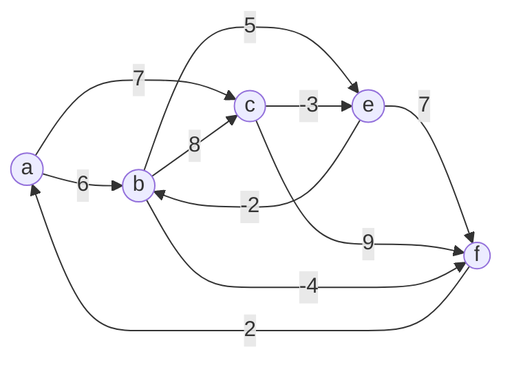
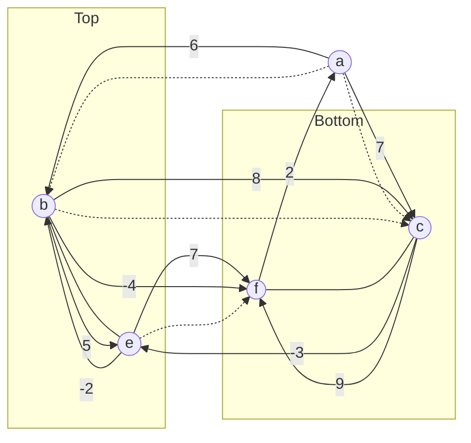

```mermaid
graph LR

a((a))
b((b))
c((c))
e((e))
f((f))

%% Top connections
b -->|5| e
e -->|-2| b

%% Left connections
a -->|6| b
a -->|7| c

%% Vertical
b -->|8| c
e -->|7| f

%% Bottom
c -->|9| f

%% Diagonals
c -->|-3| e
b -->|-4| f

%% Reverse edge
f -->|2| a

```

```mermaid
graph LR

%% Force layout rows
subgraph Top
b((b)) --- e((e))
end

subgraph Bottom
c((c)) --- f((f))
end

a((a))

%% Real edges
a -->|6| b
a -->|7| c

b -->|5| e
e -->|-2| b

b -->|8| c
c -->|-3| e

e -->|7| f
c -->|9| f

b -->|-4| f
f -->|2| a

%% Invisible edges to stabilize layout
a -.-> b
a -.-> c
b -.-> c
e -.-> f

```